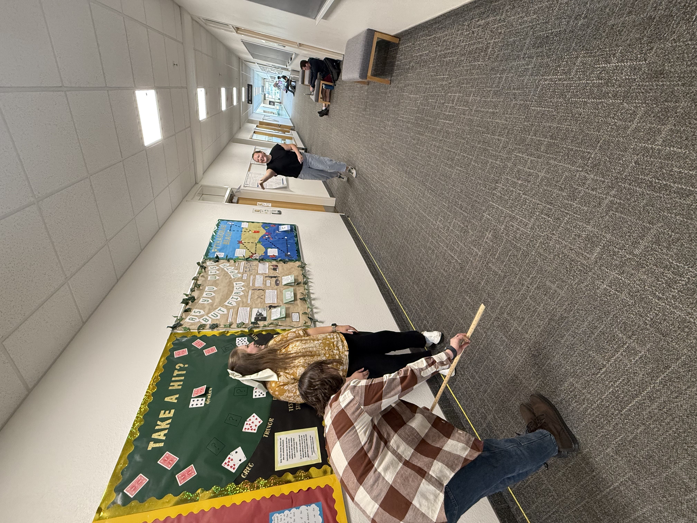

```{r, warning=FALSE, message=FALSE}
library(mosaic)
library(DT)
library(pander)
library(car)
library(tidyverse)
library(lattice)
library(dplyr)
library(ggplot2)
library(knitr)

# Record your data from your own mini experiment in Excel.
# Save the data as a .csv file in the Data folder of the Statistics-Notebook.


papair <- read_csv("../../data/paperairplaneaov.csv")

```

```{=html}
<!-- Instructions:

Perform your own mini experiment using two factors that each have at least two levels. Analyze your data using a ANOVA.

Studying reaction time is recommended because the data is quickly collected.

While you should use the warpbreaks example analyses as your guide on how to properly complete this analysis, you should also be creative in your final delivery of this analysis. If you copy the format and approach of the example analyses, be sure to give credit in your document to these example analyses. You could write something like, "This work is modeled after the [warpbreaks](https://byuistats.github.io/Statistics-Notebook/Analyses/ANOVA/Examples/warpbreaksTwoWayANOVA.html) analysis." Whatever you do, DO NOT use any of the written statements from the example analyses in your analysis unless you quote them directly and give credit. Using someone else's writing as your own without giving credit to the original author is plagiarism and is an Honor Code Violation. So do your own work. Plus, the more you try to write things in your own words, the more you will learn. Also, note that there aren't really any "rules" about exactly how your document should be organized. So be creative and organize your file in a way that makes sense to you, but still has all important elements.

-->
```



## Background 

:::{.panel-tabset}

### Introduction & Methods

I folded the planes, Cali threw them, and Stephanie recorded the distance measurements.

We folded 3 planes, 2 from the website Bro Amidan provided and 1 from my memory. That is the one factor we are testing, if different airplanes travel farther distances. We selected the 3 variations of plane based on the assumption that each one would be able to fly far over height or funny movements. Our response variable is distance.

We threw the paper airplanes in the 2nd floor hallway of the ricks, starting at the Math Lab and throwing west. We set up 50 feet of measuring tape and used a yard stick to line up the nose of the plane where it landed with the measuring tape. We threw each plane 10 times one after the other. We were systematic, 5th grade science, sharki boi, nemo. The stats on the data table under numbered order depict which plane got which throw out of the 30. for instance, nemo got the 3rd and 7th throws, etc.

Because we didn't randomize, there is a possibility that some of the throws could be biased. The first throw compared to the last could have been thrown with less energy. Also viewing the performance of the planes throughout the data collection process could lead to bias. If I was throwing the planes I would be more biased because I like one plane more than the other.

I will be performing a Basic Factor 1 or a one-way anova test the average distance flown between 3 paper airplanes.

### Data

In the data table I have included the name of the airplane used as well as the type of plane that it is. The 5th Grade Science plane was not based off of any type of plane found on the internet but is one that I created to show my 5th grade science class over 10 years ago. I had not forgotten how to make it, and there is no internet based reference on the actual type of paper airplane it is.

I have also converted the original data (collected in feet) to inches.

```{r message=FALSE, warning=FALSE}
library(dplyr)

papair <- papair %>%
  mutate(`distance (ft)` = `distance (ft)` * 12) %>% 
  mutate(distance = round(`distance (ft)`, 2))        

papair.aov <- papair %>%
  select(airplane, `type of plane`, distance, numbered_order, level_numbered_order)
```

```{r, warning=FALSE, message=FALSE}
datatable(papair.aov, options=list(lengthMenu = c(5,10,30)))
```

## Analysis {.tabset .tabset-fade}

### Hypotheses

**(1)**

$$
H_0: \mu_\text{5th Grade Science} = \mu_\text{Sharki Boi} = \mu_\text{Nemo}
$$

$$
H_a: \text{The average distance of at least one paper air plane differs}
$$

**(2)**

$$
H_0: \alpha_\text{5th Grade Science} = \alpha_\text{Sharki Boi} = \alpha_\text{Nemo} = 0
$$

$$
H_a: \alpha \ne 0 \space\text{for at least one}\space\alpha_i
$$ **Significance level is**

$$
\alpha = 0.05
$$

------------------------------------------------------------------------

### ANOVA (BF[1])

```{r, warning=FALSE, message=FALSE}
papair.aov <- aov(distance ~ airplane, data=papair)
summary(papair.aov) %>% 
  pander()
```

The ANOVA test tells us that there is significance in comparing the 3 groups. We need to take a closer look to actually see that difference. We will run some graphs and then a post hoc test to see which groups are different and more different than the others.

------------------------------------------------------------------------

### Graphs

```{r, warning=FALSE, message=FALSE}
## lets go a ggplot that's real sexy like

library(ggplot2)
library(dplyr)

ggplot(papair, aes(x=airplane, y=distance)) +
  geom_boxplot(aes(fill = airplane)) +
  theme_bw() +
  scale_fill_manual(values = c("lightgoldenrod1", "skyblue1", "lightgreen")) +
  labs(title = "Distance that Paper Airplanes Flew Down Ricks Hallway",
       fill = "airplane",
       x = "Paper Airplane Type",
       y = "Distance Flown (in)")

```

------------------------------------------------------------------------

**Airplanes Numerical Summary**

```{r, warning=FALSE, message=FALSE}
papair %>%
  group_by(airplane) %>%
  summarise(
    Average = mean(distance, na.rm = TRUE),
    Min = min(distance, na.rm = TRUE), 
    Med = median(distance, na.rm = TRUE), 
    Max = max(distance, na.rm = TRUE),
    StDev = sd(distance, na.rm = TRUE), 
    SampleSize = n()
  ) %>%
  pander()
```

Just looking at the fifth grade science we can see that the average is so much greater than the other two, even nemo is much greater than sharki boi.

------------------------------------------------------------------------

### Diagnostics

```{r, warning=FALSE, message=FALSE}

par(mfrow=c(1,3))
qqPlot(papair.aov$residuals, id=FALSE)
plot(papair.aov$fitted.values, papair.aov$residuals, pch=16)
plot(papair.aov$residuals, id=FALSE)

```

The QQ plot shows the normality of the data within the bounds so we can assume that normality assumptions are met.

There is not a megaphone pattern in the residuals vs fitted plot, there is constant variance.

The 3rd plot depicts independence, there are no obvious trends in the data so we can conclude that independence requirements have been met.

We can conclude that all requirements have been met and that we can continue with the interpretation and post hoc tests of the experiment.

------------------------------------------------------------------------

### Post Hoc Tests

#### Individual Comparisons Between the 3 Airplanes

**Tukey**

```{r, warning=FALSE, message=FALSE}
tukey.aov.papair <- TukeyHSD(papair.aov, "airplane")
par(mar=c(4,8,3,1))
plot(tukey.aov.papair, las=1)
```

In this Tukey chart we see that none of the groups overlap on the 0 line so they are all different from eachother. I chose the Tukey test because I want to keep my Type 1 error low. I also want to see the confidence intervals.

#### Grouping Comparions

```{r, warning=FALSE, message=FALSE}
library(emmeans)

air.means <- emmeans(papair.aov, "airplane", infer=c(TRUE,TRUE))

myContrasts <- contrast(air.means, list(`5thGradeSciencevsOthers`=c(1,-0.5,-0.5),
                                      `SharkiboivsOthers`=c(-0.5, 1, -0.5), 
                                      `NemovsOthers`=c(-0.5, -0.5, 1)),adjust="scheffe")
myContrasts 
```

Now this is really interesting. In comparing 5th Grade Science average distance flown is significantly different and no surprise there. Nemo vs the other 2 as well is significant where Nemo is better than Sharkiboi but worse than 5th Grade Science. But Sharkiboi compared to the other two is not significant. That plane is more averageIt's the exact opposite actually.

### Index

(I ran all the different post hocs and didn't want to straight up delete them)

**Fisher's LSD**

```{r, warning=FALSE, message=FALSE}
pa.fish <- pairwise.t.test(papair$distance, papair$airplane, "none")
pa.fish
```

**Bonferonni**

```{r, warning=FALSE, message=FALSE}
pa.bon <- pairwise.t.test(papair$distance, papair$airplane, "bonferroni")
pa.bon
```

**Scheffé**

```{r, warning=FALSE, message=FALSE}
library(agricolae)

scheffe.test(papair.aov, "airplane", console=TRUE)
```

------------------------------------------------------------------------

:::

## Interpretation

There is all the statistical significance in comparing `5th Grade Science` distance, `Nemo` distance, and `Sharki Boi` distance $\alpha$ \> 4.94e-08.

The 5th Grade Science airplane is the clear winner, consistently flying farther (mean = 346.8 inches or28.9 feet) than Nemo (mean = 255.6 inches or 21.3 feet) and Sharki Boi (mean = 192.0 inches or 16 feet). Nemo outperforms Sharki Boi, but both are outclassed by 5th Grade Science.

The differences show that 5th Grade Science flies 5–13 feet farther on average than the others. If I was going to put one of these planes in a competition I would select 5th Grade Science.

It would be easy to conclude that the paper airplanes are not equal. That was clear to me in the stages of developing the planes. When we did our first test throw of each before taking measurements 5th grade science outdid the other two in distance and consistency.

If I was performing this test again I would fold the same plane and try different additional folds or even using different weighted paper.

------------------------------------------------------------------------

: )
