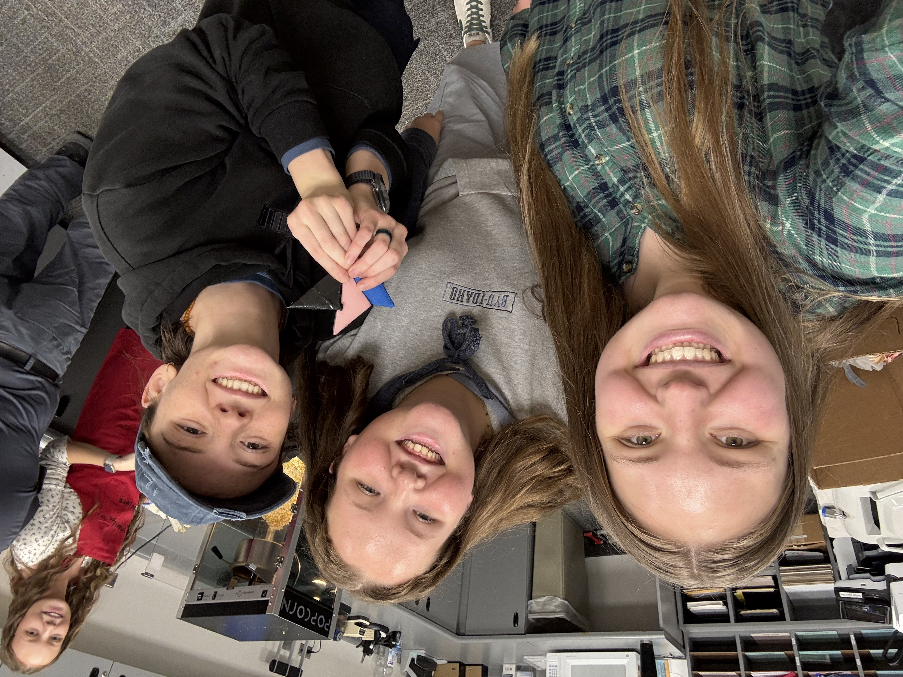

```{r, warning=FALSE, message=FALSE}
library(mosaic)
library(DT)
library(pander)
library(car)
library(tidyverse)
library(lattice)
library(dplyr)
library(ggplot2)
library(knitr)

fingerfootball <- read_csv("../../data/fingerfootballdata.csv")

```



## Background 

:::{.panel-tabset}

### Introduction & Methods

We decided to run data on finger football. The treatment factor is the tape used on the identical paper footballs. We made one with clear tape, duct tape, and masking tape. Our blocking factors were Me, Cali, Stephanie, and Shaylee. We wanted to see if the distance we could flick the football would be different across the tape factors. We measure the distance past the goal post in inches.

We randomized the treatment and block using the randomization tool.

### Data

```{r message=FALSE, warning=FALSE}
library(dplyr)

finfoot.aov <- na.omit(fingerfootball) %>%
  select(inches, block, tape)


```

```{r, warning=FALSE, message=FALSE}
datatable(finfoot.aov, options=list(lengthMenu = c(4, 6, 12, 18)))
```

:::

## Analysis 

:::{.panel-tabset}

### Hypothesis

$$
H_0: FingerFootball(\beta_j) = 0 \text{ for all tapes}(j)
$$

$$
H_a: FingerFootball(\beta_j) \ne 0 \text{ for some tapes}(j)
$$

We hypothesize that there will be a difference in the 3 different finger footballs. We used 4 people as out blocking measure to flick the 3 differently taped finger footballs. We will use an $\alpha$ = 0.5 in our tests to measure significance. 


**Mathematical Model**

$$
y_{ij} = \mu + \text{PersonBlock}(\alpha_i) + \text{TapeFingerFootball}\beta_j + \epsilon_{ij}
\tag{1}
$$

Alpha is our blocking factor (person), Beta is our treatment factor (finger football).

**Significance level is**

$$
\alpha = 0.05
$$

------------------------------------------------------------------------

### ANOVA (CB[1])

```{r, warning=FALSE, message=FALSE}
finfoot.aov <- aov(inches ~ block + tape, data=na.omit(fingerfootball))
summary(finfoot.aov)

```

The Anova test shows that the tapes are not significantly different from each other so I will run a few post hocs to see which groups are more significant to each other

------------------------------------------------------------------------

### Numerical Summaries

------------

**Block (person) Numerical Summary**

```{r, warning=FALSE, message=FALSE}
fingerfootball %>%
  group_by(block) %>%
  summarise(
    Average = mean(inches, na.rm = TRUE),
    Min = min(inches, na.rm = TRUE), 
    Med = median(inches, na.rm = TRUE), 
    Max = max(inches, na.rm = TRUE),
    StDev = sd(inches, na.rm = TRUE), 
    SampleSize = n()
  ) %>%
  pander()
```
From this numerical summary we can see that the smallest standard deviation was from Stephanie and her average was the 2nds highest. Her shots were more consistent across the 3 tapes. 

Lexi had the highest average because she had the highest shot which was the duct tape football. She also had the greatest standard deviation, meaning less consistency. 

Cali and Shaylee had the same average but difference of 5 inches in the standard deviation. Shaylee had the lowest distance. 

These averages are clearly very different, at least comparing Cali and Shaylee to Lexi and Stephanie. 

---------

**Factor (tape) Numerical Summary**

```{r, warning=FALSE, message=FALSE}
fingerfootball %>%
  group_by(tape) %>%
  summarise(
    Average = mean(inches, na.rm = TRUE),
    Min = min(inches, na.rm = TRUE), 
    Med = median(inches, na.rm = TRUE), 
    Max = max(inches, na.rm = TRUE),
    StDev = sd(inches, na.rm = TRUE), 
    SampleSize = n()
  ) %>%
  pander()
```
Over the 3 duct tapes with the 4 people shooting each one one time we see that the highest variability came from the clear with a 62.28 inch standard deviation. 

The duct tape had the highest average with a stdev of 49.43, I believe this one the most. 

Masking had the lowest average and the lowest standard deviation. 

Our ANOVA says that the differences in these finger footballs are not significant. Maybe our post-hocs will tell us some variation. 

---------

### Variable Graphs

------------------------------------------------------------------------

**Person Graph**

```{r, warning=FALSE, message=FALSE}
library(ggplot2)
library(dplyr)

ggplot(fingerfootball, aes(x=block, y=inches)) +
  geom_boxplot(aes(fill = block)) +
  theme_bw() +
  scale_fill_manual(values = c("cadetblue1", "seagreen", "gray", "ivory")) +
  labs(title = "Person's Shooting of Finger Football",
       fill = "Person Blocking Factor",
       x = "Person",
       y = "Distance Football Was Shot (in)")

```

We can see from this graph the drastic appearance of difference between Cali and Shaylee (who appear almost the same on the low end of the graph) and Lexi and Stephanie who appear to have gone the distance and a;sp seem to be close enough that their averages seem similar. 

**Tape Graph**

```{r, warning=FALSE, message=FALSE}
library(ggplot2)
library(dplyr)

ggplot(fingerfootball, aes(x=tape, y=inches)) +
  geom_boxplot(aes(fill = tape)) +
  theme_bw() +
  scale_fill_manual(values = c("pink", "skyblue2", "black")) +
  labs(title = "Taped Finger Football Distance",
       fill = "Football Type",
       x = "Tape Football",
       y = "Distance Football Was Shot (in)")

```

We can see the most variation in the clear one, least appears to be masking, and the averages all seem close together. 


### Diagnostics (Test Assumptions)

```{r, warning=FALSE, message=FALSE}

library(car)

par(mfrow=c(1,3))
qqPlot(finfoot.aov$residuals, id=FALSE)
plot(finfoot.aov$fitted.values, finfoot.aov$residuals, pch=16)
plot(finfoot.aov$residuals, id=FALSE)

```

The QQ plot shows the normality of the data within the bounds so we can assume that normality assumptions are met.

There is not a megaphone pattern in the residuals vs fitted plot, but it is close, I believe it is good enough to say there is constant variance.

The 3rd plot depicts independence, there are no obvious trends in the data so we can conclude that independence requirements have been met.

We can conclude that all requirements have been met and that we can continue with the interpretation and post hoc tests of the experiment.

------------------------------------------------------------------------

### Post Hoc Tests

#### Grouping Comparions

```{r, warning=FALSE, message=FALSE}
library(emmeans)

ff.means <- emmeans(finfoot.aov, "tape", infer=c(TRUE,TRUE))

myContrasts <- contrast(ff.means, list(`ductvsothers`=c(1,-0.5, -0.5), 
                                       `clearvsothers` =c(-0.5, 1, -0.5), 
                                       `maskingvsothers` =c(-0.5, -0.5, 1)),adjust="scheffe")

myContrasts
```

This grouping comparisons shows that each is not significantly different than the other, with duct being the most not different. Let's run some more post hocs for fun.

**Tukey**

```{r, warning=FALSE, message=FALSE}
tukey.aov.finfoot <- TukeyHSD(finfoot.aov, "tape")
par(mar=c(4,8,3,1))
plot(tukey.aov.finfoot, las=1)
```

They all cross over the 0 line signifying that there is no difference in the tape that accounted for the distance after the goal line.

**TAPE Fisher's LSD**

```{r, warning=FALSE, message=FALSE}
ff.fish <- pairwise.t.test(fingerfootball$inches, fingerfootball$tape, "none")
ff.fish
```

Masking and duct are the most almost different but still not significant. I do want to take a closer look at the blocks since they were found to be significant in our aov although we don't care about it.

**BLOCK Fisher's LSD**

```{r, warning=FALSE, message=FALSE}
ff.fish2 <- pairwise.t.test(fingerfootball$inches, fingerfootball$block, "none")
ff.fish2
```

This shows that Cali was not different than

**TAPE Scheffé**

```{r, warning=FALSE, message=FALSE}
library(agricolae)

scheffe.test(finfoot.aov, "tape", console=TRUE)
```

Yep, these were not found to be significant, all are the same group.

**BLOCK Scheffé**

```{r, warning=FALSE, message=FALSE}
library(agricolae)

scheffe.test(finfoot.aov, "block", console=TRUE)
```

Both Shaylee and Cali were just over 79 inches average between the 3 finger footballs but Stephanie and I were double or more than that. (We ran a few practice flicks) but this shows that Stephanie and I were sending those finger footballs whereas Shaylee and Cali struggled a little bit.

------------------------------------------------------------------------
:::

## Interpretation

The results of the experiment were insignificant. I'm not totally surprised, if we were able to run replications I believe we would have found more significant data between the 3 footballs. I think the experiment was fun but this was probably not the right way to test this data. Although we really don't care about the human performance in this it was still interesting to see if there was a competition who would reign supreme ;)

------------------------------------------------------------------------

: )
