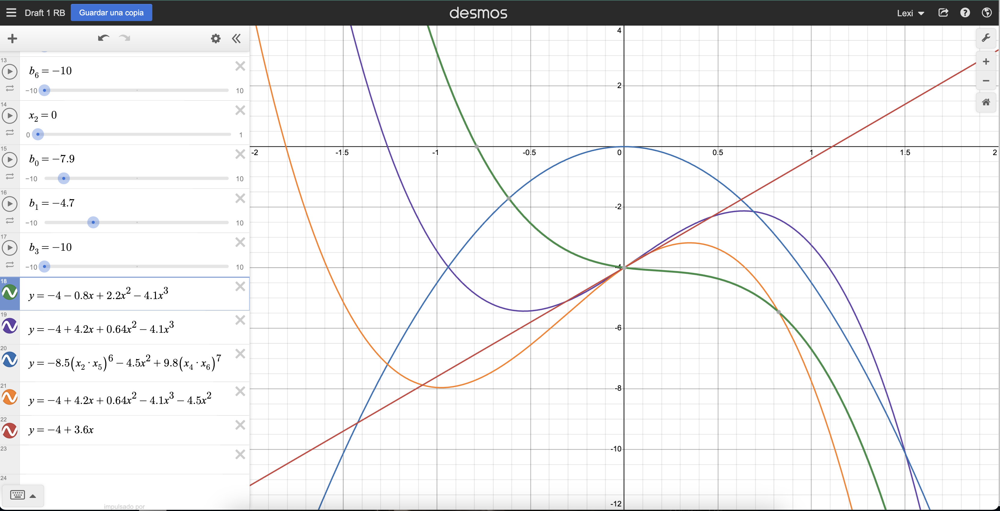

```{r message=FALSE, warning=FALSE}
library(pander)
library(tidyverse)
library(ggplot2)
```

::: {.panel-tabset}

## Instructions 

Using [Desmos](https://www.desmos.com/calculator), design a "true linear regression model" that is **2D-Drawable**, and follows all other **Regression Battleship Rules** (listed below), that is of the form 

$$
y\ =\ b_{0}\ +\ b_{1}x_{4}\ +\ b_{2}x+b_{3}x^{2}+b_{4}x^{3}+\ b_{5}x^{4}+b_{6}x\cdot x_{2}+b_{7}\left(x\cdot x_{1}\right)^{5}
$$


$$
  Y_i = \beta_0 + \underbrace{\quad\quad\quad\ldots\quad\quad\quad}_\text{Your Model Goes Here} + \epsilon_i \quad \text{where} \ \epsilon_i \sim N(0, \sigma^2)
$$ 

Then, use a simulation in R and your linear regression model to obtain a sample of data saved as `rbdata.csv`. 

Your sample of data will be given to other students and your teacher, but this Rmd file (which contains the secret on how you made your data) will remain hidden until after the competition is complete. Your teacher and two of your peers will use the sample of data your provide, `rbdata.csv`, to try to **guess** the **true linear regression model** you used to create the data. The goal is to hide your model well enough that no one can find it, while keeping the R-squared of your data as high as possible.

### Official Rules {.tabset}

#### Advanced Level Competition

Competing in the *Advanced Level* will allow you the opportunity to earn full credit on the Regression Battleship portion of your grade in Math 425 (which is 15% of your Final Grade). However, if you compete at this level, you cannot ever discuss your actual model with your teacher. You can still ask for help from the TA, tutors, or other students that you are not competing against. And you can ask "vague" questions to your teacher as long as it doesn't give too much away about your model.

There are five official rules your model must abide by. If you break any of the rules, you will be disqualified from winning the competition and a grade penalty will result.

1. Your csv file `rbdata.csv` must contain **11 columns of data**.
    * The first column must be your (1) y-variable (labeled as `y`).
    * The other ten columns must be (10) x-variables (labeled as `x1`, `x2`, ... , `x10`). *Please use all lower-case letters.* It does not matter which x-variables you use in your model, and you don't need to use all 10 x-variables in your model.
   
<br/>
    
2. Your **y-variable** (or some transformation of the y-variable) must have been **created from a linear regression model** using only x-variables (or transformations of those x-variables) **from** within **your data set**.
    * Be very careful with transformations. You must ensure that you do not break the rules of a linear regression if you choose to use transformations.
    * If you choose transformations, only these functions are allowed when transforming X and Y variables: `1/Y^2`, `1/Y`, `log(Y)`, `sqrt(Y)`, `sqrt(sqrt(Y))`, `Y^2`, `Y^3`, `1/X^2`, `1/X`, `log(X)`, `sqrt(X)`, `sqrt(sqrt(X))`, `X^2`, `X^3`, `X^4`, and `X^5`. Don't forget to check Rule #3 carefully if you choose transformations.

<br/>
    
3. Your **sample size** must be sufficiently large so that when the true model is fit to your data using lm(...), **all p-values** of terms found in the `summary(...)` output **are significant** at the $\alpha = 0.05$ level.

4. The $R^2$ value ("Multiple R-squared", not the "Adjusted R-squared") of your true model fit on your `rbdata` sample must be greater than or equal to $0.30$. The higher your $R^2$ value, the more impressive your model.

5. Your true model must be **2D-drawable**. This means that it can be drawn in both Desmos and with a single 2D scatterplot in R.

<br/>
<br/>


## Desmos 

Start by creating a picture of your true model in Desmos. Snip a screenshot of your completed model. Include a picture of your Desmos graph showing your true model.


{fig-align="center" width="100%"}


## Code

Use the R-chunks below to create your simulated sample of data from your true regression model.


```{r, comment=NA}
set.seed(1)
  
 n <- 120
  
## Then, create 10 X-variables using functions like rnorm(n, mean, sd), rchisq(n, df), rf(n, df1, df2), rt(n, df), rbeta(n, a, b), runif(n, a, b) or sample(c(1,0), n, replace=TRUE)... ## To see what any of these functions do, run codes like hist(rchisq(n, 3)). These functions are simply allowing you to get a random sample of x-values. But the way you choose your x-values can have quite an impact on what the final scatterplot of the data will look like.

 x1 <- runif(n, -4, 4) #garbage
 
 x2 <- sample(c(0,1), n, replace = TRUE) #switch for green
 
 x3 <- sample(c(0,1), n, replace = TRUE) #garbage
 
 x4 <- runif(n, -3, 4) #garbage
 
 x5 <- sample(c(0,1), n, replace = TRUE) #switch for purple
 
 x6 <- runif(n, -2, 2) #quantitative//actual x
 
 x7 <- runif(n, -2, 2) #garbage
 
 x8 <- sample(c(0,1), n, replace = TRUE) #switch for orange
 
 x9 <- sample(c(0,1), n, replace = TRUE) # garbage
 
 x10 <- sample(c(0,1), n, replace = TRUE) #switch for blue
 
x10[x10==0 & x2==0 & x5==0 & x8==0] <- 1
x10[x10==1 & x2==1 & x5==0 & x8==0] <- 0
x2[x10==0 & x2==0 & x5==1 & x8==0] <- 1
x5[x10==1 & x2==0 & x5==1 & x8==0] <- 0
x10[x10==1 & x2==0 & x5==1 & x8==1] <- 0
x2[x10==0 & x2==0 & x5==1 & x8==1] <- 1
x5[x10==0 & x2==0 & x5==0 & x8==1] <- 1
x2[x10==0 & x2==1 & x5==0 & x8==1] <- 1
x8[x10==1 & x2==1 & x5==1 & x8==0] <- 1
x2[x10==1 & x2==1 & x5==0 & x8==1] <- 0
x10[x10==1 & x2==1 & x5==1 & x8==1] <- 0
x2[x10==1 & x2==0 & x5==0 & x8==1] <- 1
x10[x10==0 & x2==1 & x5==1 & x8==0] <- 0
x2[x10==1 & x2==0 & x5==0 & x8==1] <- 1
x10[x10==1 & x2==1 & x5==0 & x8==1] <- 0
x8[x10==0 & x2==1 & x5==0 & x8==1] <- 0
x2[x10==0 & x2==0 & x5==1 & x8==1] <- 1
x5[x10==1 & x2==1 & x5==1 & x8==1] <- 0
 
 beta0 <- -4
 beta1 <- 4.7 # simple red line
 
 beta2 <- 4
 beta3 <- -4.7
 beta4 <- -4.5 # blue quadractic
 
 beta5 <- -0.0256
 beta6 <- -5.5
 beta7 <- 2.2
 beta8 <- -4.1 # green cubic
 
 beta9 <- 5
 beta10 <- -1.56 # purple cubic
 
 beta11 <- -4.5 # orange 4

 sigma <- 2.2 #change to whatever positive number you want
 
 ################################
 # You ARE NOT ALLOWED to change this part:
 epsilon_i <- rnorm(n, 0, sigma)
 ################################ 
 
 y <- beta0 + beta1*x6 + #red
   beta4*x6^2*x10 + #blue
   #beta5*x2 + 
   beta6*x6*x2 + beta7*x6^2*x2 + beta8*x6^3*x2 + #green
   beta9*x6*x5*x2 + beta10*x6^2*x5*x2 + #purple
   beta11*x6^2*x2*x5*x8 + #orange 
   epsilon_i

 rbdata <- data.frame(y, x1, x2, x3, x4, x5, x6, x7, x8, x9, x10)
 
 mylm <- lm(y ~  x6 + #red
   I(x6^2):x10 + #blue
   #x2 + 
   x6:x2 + I(x6^2):x2 + I(x6^3):x2 + #green
   x6:x5:x2 + I(x6^2):x5:x2 + #purple
   I(x6^2):x2:x5:x8, #orange
   data=rbdata) #edit this code to be your true model
 summary(mylm)

# Once you are done with creating your model, and have successfully
# graphed it (see below), un-comment the following `write.csv` code,
# then, PLAY this ENTIRE R-chunk to write your data to a csv.

 write.csv(rbdata, "rbdata.csv", row.names=FALSE)

# The above code writes the dataset to your "current directory"
# To see where that is, use: getwd() in your Console.
# Find the rbdata.csv data set and upload it to I-Learn.
```

## R Plot

Provide a 2D scatterplot that shows both your *true* model (dashed lines) and *estimated* model (solid lines) on the same scatterplot. This should match your Desmos graph. 

```{r message=FALSE, warning=FALSE}
library(ggplot2)

b <- coef(mylm)

b0 <- b[1]
b1 <- b[2]
b4 <- b[3]
b6 <- b[4]
b7 <- b[5]
b8 <- b[6]
b9 <- b[7]
b10 <- b[8]
b11 <- b[9]

ggplot(rbdata, aes(y=y, x=x6, color=interaction(x10, x2, x5, x8))) +
  geom_point() +
    stat_function(fun=function(x) beta0 + beta1*x, color = "red", lwd = 1) +
    stat_function(fun=function(x) (beta0 + beta2) + (beta1 + beta3)*x + beta4*x^2, color = "steelblue", lwd=1) +
    stat_function(fun=function(x) (beta0) + (beta1 + beta6)*x + beta7*x^2 + beta8*x^3, color = "forestgreen", lwd=1) +
    stat_function(fun=function(x) (beta0) + (beta1 + beta6 + beta9)*x + (beta7 + beta10)*x^2 + beta8*x^3, color = "mediumpurple", lwd=1) +
    stat_function(fun=function(x) (beta0) + (beta1 + beta6 + beta9)*x + (beta7 + beta10 + beta11)*x^2 + beta8*x^3, color = "orange", lwd=1) +

stat_function(fun=function(x) b0 + b1*x, color = "red", linetype = "dashed", lwd = 1) +
    stat_function(fun=function(x) (b0 + b1)*x + b4*x^2, color = "steelblue", linetype = "dashed", lwd=1) +
    stat_function(fun=function(x) b0 + (b1 + b6)*x + b7*x^2 + b8*x^3, color = "forestgreen", linetype = "dashed",  lwd=1) +
    stat_function(fun=function(x) b0 + (b1 + b6 + b9)*x + (b7 + b10)*x^2 + b8*x^3, color = "mediumpurple", linetype = "dashed",  lwd=1) +
    stat_function(fun=function(x) b0 + (b1 + b6 + b9)*x + (b7 + b10 + b11)*x^2 + b8*x^3, color = "orange", linetype = "dashed", lwd=1) +
  coord_cartesian(ylim=c(-12, 4)) +
  theme_bw()

```

## Math Model

Write out your "true" model in mathematical form. Make sure it matches your code. This could be "painful" if you chose a complicated model.


$$
Y_i = \beta_0 + \beta_1 X_{6i} + \beta_2 + \beta_3 + \beta_4 X_{6i}^2 X_{10i} + \beta_5 X_{2i} + \beta_6 X_{6i} X_{2i} + \beta_7 X_{6i}^2 X_{2i} + \beta_8 X_{6i}^3 X_{2i} + \beta_9 X_{6i} X_{5i} X_{2i} + \beta_10 X_{6i}^2 X_{5i} X_{2i} + \beta_11 X_{6i}^2 X_{5i} X_{2i} X_{8i} +\epsilon_i
$$

## Results

Once the Regression Battleship competition is completed, you will be given instructions on how to complete this section. The basic idea is to compare the three guesses at your true model (from two peers, and your teacher) to decide who won (i.e., who had the closest guess).

```{r}
set.seed(5)
  
 n <- 120
  
## Then, create 10 X-variables using functions like rnorm(n, mean, sd), rchisq(n, df), rf(n, df1, df2), rt(n, df), rbeta(n, a, b), runif(n, a, b) or sample(c(1,0), n, replace=TRUE)... ## To see what any of these functions do, run codes like hist(rchisq(n, 3)). These functions are simply allowing you to get a random sample of x-values. But the way you choose your x-values can have quite an impact on what the final scatterplot of the data will look like.

 x1 <- runif(n, -4, 4) #garbage
 
 x2 <- sample(c(0,1), n, replace = TRUE) #switch for green
 
 x3 <- sample(c(0,1), n, replace = TRUE) #garbage
 
 x4 <- runif(n, -3, 4) #garbage
 
 x5 <- sample(c(0,1), n, replace = TRUE) #switch for purple
 
 x6 <- runif(n, -2, 2) #quantitative//actual x
 
 x7 <- runif(n, -2, 2) #garbage
 
 x8 <- sample(c(0,1), n, replace = TRUE) #switch for orange
 
 x9 <- sample(c(0,1), n, replace = TRUE) # garbage
 
 x10 <- sample(c(0,1), n, replace = TRUE) #switch for blue
 
x10[x10==0 & x2==0 & x5==0 & x8==0] <- 1
x10[x10==1 & x2==1 & x5==0 & x8==0] <- 0
x2[x10==0 & x2==0 & x5==1 & x8==0] <- 1
x5[x10==1 & x2==0 & x5==1 & x8==0] <- 0
x10[x10==1 & x2==0 & x5==1 & x8==1] <- 0
x2[x10==0 & x2==0 & x5==1 & x8==1] <- 1
x5[x10==0 & x2==0 & x5==0 & x8==1] <- 1
x2[x10==0 & x2==1 & x5==0 & x8==1] <- 1
x8[x10==1 & x2==1 & x5==1 & x8==0] <- 1
x2[x10==1 & x2==1 & x5==0 & x8==1] <- 0
x10[x10==1 & x2==1 & x5==1 & x8==1] <- 0
x2[x10==1 & x2==0 & x5==0 & x8==1] <- 1
x10[x10==0 & x2==1 & x5==1 & x8==0] <- 0
x2[x10==1 & x2==0 & x5==0 & x8==1] <- 1
x10[x10==1 & x2==1 & x5==0 & x8==1] <- 0
x8[x10==0 & x2==1 & x5==0 & x8==1] <- 0
x2[x10==0 & x2==0 & x5==1 & x8==1] <- 1
x5[x10==1 & x2==1 & x5==1 & x8==1] <- 0
 
 beta0 <- -4
 beta1 <- 4.7 # simple red line
 
 beta2 <- 4
 beta3 <- -4.7
 beta4 <- -4.5 # blue quadractic
 
 beta5 <- -0.0256
 beta6 <- -5.5
 beta7 <- 2.2
 beta8 <- -4.1 # green cubic
 
 beta9 <- 5
 beta10 <- -1.56 # purple cubic
 
 beta11 <- -4.5 # orange 4

 sigma <- 2.2 #change to whatever positive number you want
 
 ################################
 # You ARE NOT ALLOWED to change this part:
 epsilon_i <- rnorm(n, 0, sigma)
 ################################ 
 
 y <- beta0 + beta1*x6 + #red
   beta4*x6^2*x10 + #blue
   #beta5*x2 + 
   beta6*x6*x2 + beta7*x6^2*x2 + beta8*x6^3*x2 + #green
   beta9*x6*x5*x2 + beta10*x6^2*x5*x2 + #purple
   beta11*x6^2*x2*x5*x8 + #orange 
   epsilon_i

 rbdata2 <- data.frame(y, x1, x2, x3, x4, x5, x6, x7, x8, x9, x10)
 
 
 lmt <- lm(y ~  x6 + I(x6^2):x10 + x6:x2 + I(x6^2):x2 + I(x6^3):x2 + x6:x5:x2 + I(x6^2):x5:x2 + I(x6^2):x2:x5:x8, data=rbdata)
 
 lmbs <- lm(y ~ x6 + I(x6^2) + x2:x6 + x2:I(x6^2) + x2:I(x6^3) + x8:x6 + x8:I(x6^2), data=rbdata)
 
 lms <- lm(y ~ x6 + x10 + x6:x10 + x10:x6, data=rbdata)
 
 lmj <- lm(y~ x6 + I(x6^2) + x2:x6 + x2:I(x6^2) + x2:I(x6^3) + x8:x6 + x8:I(x6^2), data = rbdata)
 
 
 
```


 
```{r}
# Compute R-squared for each validation

  # Get y-hat for each model on new data.
  yht <- predict(lmt, newdata=rbdata2)
  yhbs <- predict(lmbs, newdata=rbdata2)
  yhs <- predict(lms, newdata=rbdata2)
  yhj <- predict(lmj, newdata=rbdata2)
  
  # Compute y-bar
  ybar <- mean(rbdata2$y) #Yi is given by Ynew from the new sample of data
  
  # Compute SSTO
  SSTO <- sum( (rbdata2$y - ybar)^2 )
  
  # Compute SSE for each model using y - yhat
  SSEt <- sum( (rbdata2$y - yht)^2 )
  SSEbs <- sum( (rbdata2$y - yhbs)^2 )
  SSEs <- sum( (rbdata2$y - yhs)^2 )
  SSEj <- sum( (rbdata2$y - yhj)^2 )
  
  # Compute R-squared for each
  rst <- 1 - SSEt/SSTO
  rsbs <- 1 - SSEbs/SSTO
  rss <- 1 - SSEs/SSTO
  rsj <- 1 - SSEj/SSTO
  
  # Compute adjusted R-squared for each
  n <- length(rbdata2$y) #sample size
  pt <- length(coef(lmt)) #num. parameters in model
  pbs <- length(coef(lmbs)) #num. parameters in model
  ps <- length(coef(lms)) #num. parameters in model
  pj <- length(coef(lmj)) #num. parameters in model
  rsta <- 1 - (n-1)/(n-pt)*SSEt/SSTO
  rsbsa <- 1 - (n-1)/(n-pbs)*SSEbs/SSTO
  rssa <- 1 - (n-1)/(n-ps)*SSEs/SSTO
  rsja <- 1 - (n-1)/(n-pj)*SSEj/SSTO
  

my_output_table2 <- data.frame(Model = c("True", "Bro Saunders", "Scott", "Josh"), `Original R2` = c(summary(lmt)$r.squared, summary(lmbs)$r.squared, summary(lms)$r.squared, summary(lmj)$r.squared), `Orig. Adj. R-squared` = c(summary(lmt)$adj.r.squared, summary(lmbs)$adj.r.squared, summary(lms)$adj.r.squared, summary(lmj)$adj.r.squared), `Validation R-squared` = c(rst, rsbs, rss, rsj), `Validation Adj. R^2` = c(rsta, rsbsa, rssa, rsja))

colnames(my_output_table2) <- c("Model", "Original $R^2$", "Original Adj. $R^2$", "Validation $R^2$", "Validation Adj. $R^2$")

knitr::kable(my_output_table2, escape=TRUE, digits=4)
```


##### My Model

```{r}
library(ggplot2)

b <- coef(lmt)

b0 <- b[1]
b1 <- b[2]
b4 <- b[3]
b6 <- b[4]
b7 <- b[5]
b8 <- b[6]
b9 <- b[7]
b10 <- b[8]
b11 <- b[9]

ggplot(rbdata2, aes(y=y, x=x6, color=interaction(x10, x2, x5, x8))) +
  geom_point() +
    stat_function(fun=function(x) beta0 + beta1*x, color = "red", lwd = 1) +
    stat_function(fun=function(x) (beta0 + beta2) + (beta1 + beta3)*x + beta4*x^2, color = "steelblue", lwd=1) +
    stat_function(fun=function(x) (beta0) + (beta1 + beta6)*x + beta7*x^2 + beta8*x^3, color = "forestgreen", lwd=1) +
    stat_function(fun=function(x) (beta0) + (beta1 + beta6 + beta9)*x + (beta7 + beta10)*x^2 + beta8*x^3, color = "mediumpurple", lwd=1) +
    stat_function(fun=function(x) (beta0) + (beta1 + beta6 + beta9)*x + (beta7 + beta10 + beta11)*x^2 + beta8*x^3, color = "orange", lwd=1) +

stat_function(fun=function(x) b0 + b1*x, color = "red", linetype = "dashed", lwd = 1) +
    stat_function(fun=function(x) (b0 + b1)*x + b4*x^2, color = "steelblue", linetype = "dashed", lwd=1) +
    stat_function(fun=function(x) b0 + (b1 + b6)*x + b7*x^2 + b8*x^3, color = "forestgreen", linetype = "dashed",  lwd=1) +
    stat_function(fun=function(x) b0 + (b1 + b6 + b9)*x + (b7 + b10)*x^2 + b8*x^3, color = "mediumpurple", linetype = "dashed",  lwd=1) +
    stat_function(fun=function(x) b0 + (b1 + b6 + b9)*x + (b7 + b10 + b11)*x^2 + b8*x^3, color = "orange", linetype = "dashed", lwd=1) +
  coord_cartesian(ylim=c(-12, 4)) +
  theme_bw()
```

##### Bro Saunders

```{r}
plot(y ~ x6, data=rbdata2, col=interaction(x2,x8, drop=TRUE))
points(lmbs$fit ~ x6, data=rbdata2, col=interaction(x2,x8, drop=TRUE), pch=16, cex=0.5)

b <- coef(lmbs)

drawit <- function(x2=0, x8=0, i=1){
  curve(b[1] + b[2]*x6 + b[3]*x6^2 + b[4]*x6*x2 + b[5]*x6^2*x2 + b[6]*x2*x6^3 + b[7]*x6*x8 + b[8]*x6^2*x8, add=TRUE, xname="x6", col=palette()[i])  
}

drawit(0,0,1)
drawit(1,0,2)
drawit(1,1,3)
```

##### Commentary

Josh and Brother Saunders had the exact same linear model so they both win.  The best overall adjusted and and validated R-squared was from both of them. No ones were exactly my true model. 

:::
 